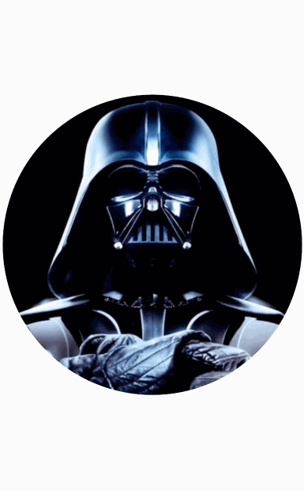
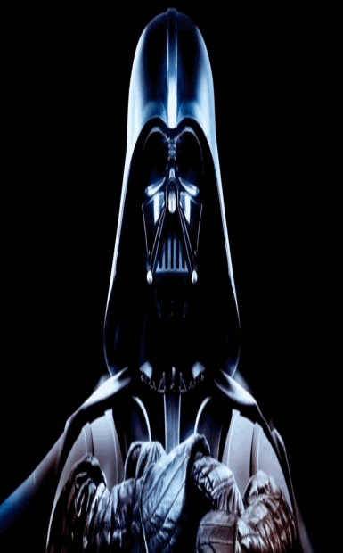
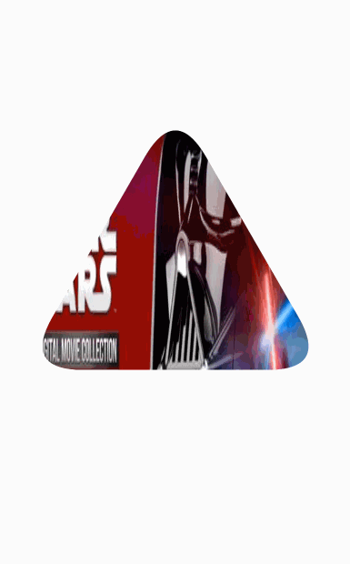
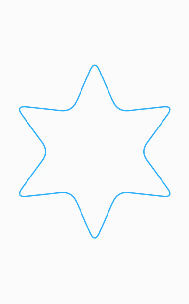
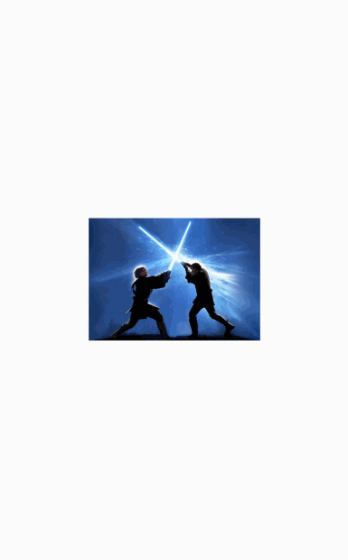

# UILibrary

---

把平时写的用到项目里面的一些UI相关的View、Drawable等整理了一下，持续更新

主要有以下一些效果:

**跟着Path运动的ProgressBar效果**

**QQ群头像效果的控件**

**苹果app下载的进度效果**

**任意形状的遮罩**

**带圆角的任意正多边形和星型**

**带动画效果切换ScaleType的ImageView**

